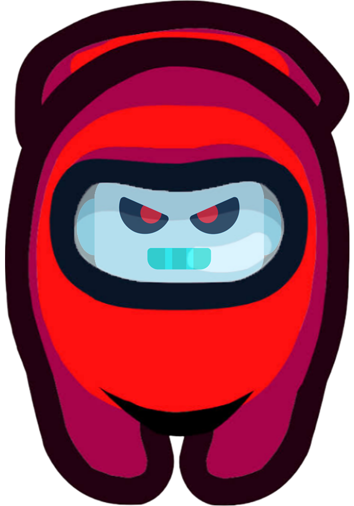

# AImposter

Can you spot the AI imposter among a set of prompts and responses?

    

## Background
Players will review a series of prompts paired with various responses. The goal is to correctly identify the one response which was generated by an AI chatbot. Players will receive feedback throughout the quiz and a final score at the end. 

With recent advances in artificial intelligence, it is becoming harder for individuals to discern between human and AI sources. This quiz aims to educate people on the ease of being fooled by chatbots and the consequences of not carefully reviewing information.

## Development 
1. `npm install`
2. `npm start`
